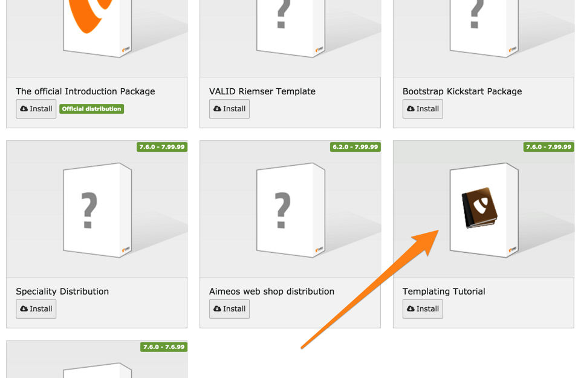
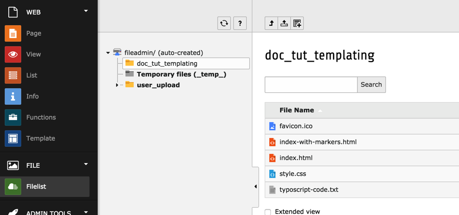

.. include:: /Includes.rst.txt

.. _installation:
.. _preparation:

Installation
^^^^^^^^^^^^

In this tutorial, we will mostly work with an HTML template, a CSS file and
a basic page tree. All these resources are bundled into a distribution, in
the same way as the Official Introduction Package, which you will be familiar
with if you have been through the :ref:`Getting Started Tutorial <t3start:start>`.

It is recommended to start with a blank site, but the distribution can be
also loaded into an existing installation.

:ref:`Follow the same steps <t3start:installation>` as for the Getting Started Tutorial.
At the point where you choose the distribution, however, select the "Templating Tutorial".

Installing the distribution creates a new page tree, with a root page
called "Tutorial Root". Moving to the **WEB > Page** module, you should
see the following:

.. figure:: ../Images/InstallationPageTree.png
   :alt: The automatically created page tree

Furthermore several files have been copied into :file:`fileadmin/doc_tut_templating`.
You can view them by moving to the **FILE > Filelist** module:

