.. ==================================================
.. FOR YOUR INFORMATION
.. --------------------------------------------------
.. -*- coding: utf-8 -*- with BOM.

.. include:: ../Includes.txt

.. _preparation:

Preparation
^^^^^^^^^^^

This tutorial comes with example files, which are used throughout this tutorial. These files include the HTML template, which we use in this tutorial. Use them to reproduce each step of what we do in your own TYPO3 installation.

To get all the needed files, please download this extension and install it into your TYPO3 installation; do not only view it in the TYPO3 Extension Repository (TER) or online at typo3.org. By installing it you directly have all the needed template files (HTML, CSS and the TypoScript in an textfile) on your system.

(If you have already done that, you can skip the rest of this chapter.).

.. note::
   The extension key of this tutorial is "doc_tut_templating". Search for it in your extension manager.
   Installing this extension in your TYPO3 installation

Result: The extension is shown as "installed". Installing the extension is not needed, but if installing worked for the user (which we can check easily), we know that the files are in place for the next step.

Copying the template files to the right place
"""""""""""""""""""""""""""""""""""""""""""""

Now you have the extracted files in your file system. They are, from the folder where you installed TYPO3, inside the subfolder typo3conf/ext/doc_tut_templating/template. Next copy the folder "template" with its contents and paste it all into the folder fileadmin/, so that you get the folder fileadmin/template/ and the files inside.
Creating a page structure

We will now create some pages inside TYPO3. These pages are helpful, when you later want to check, if TYPO3 uses the instructions in the TypoScript template as we want it to use them. When you created some pages and some subpages, you will later be able to check if TYPO3 creates the desired output. After you have configured the menu in the TypoScript template, the structure of these pages should be visible in the menu. If you put some content on some of these pages in TYPO3, you will also be able to see this content once you have configured the corresponding part of the TypoScript template.

We now show you detailed, how to create that page structure. We are using the Introduction Package for the screenshots, if you are using the blank package, it is the same. Just ignore the already present "Home" and "TypoScript-Templates"-Trees of the introduction package.

In the TYPO3 backend make sure you are in the page module by opening the section "Web" in the left part of the Backend and by clicking the "Page" module in this section.

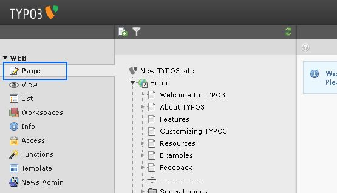

Create a first page, which hierarchically is located directly below the TYPO3 logo at the top. We call this page "root" page. Rightclick on the logo of "New TYPO3 site", then leftclick New.

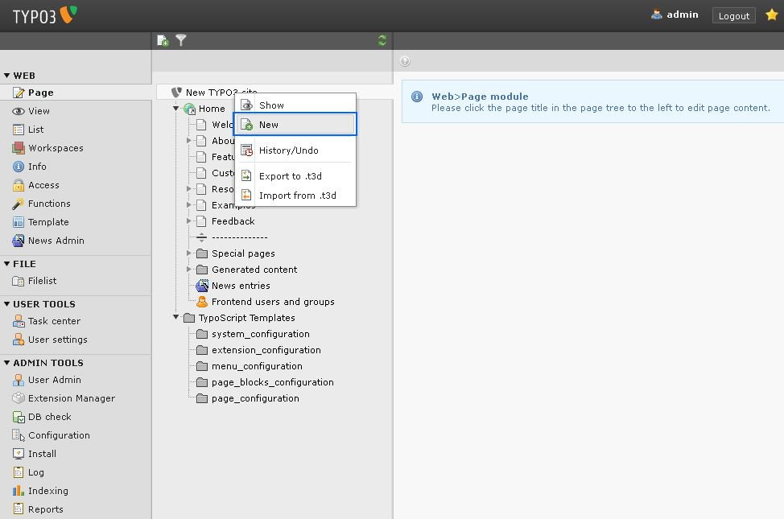

Place the page at the bottom of the present pages/folders.

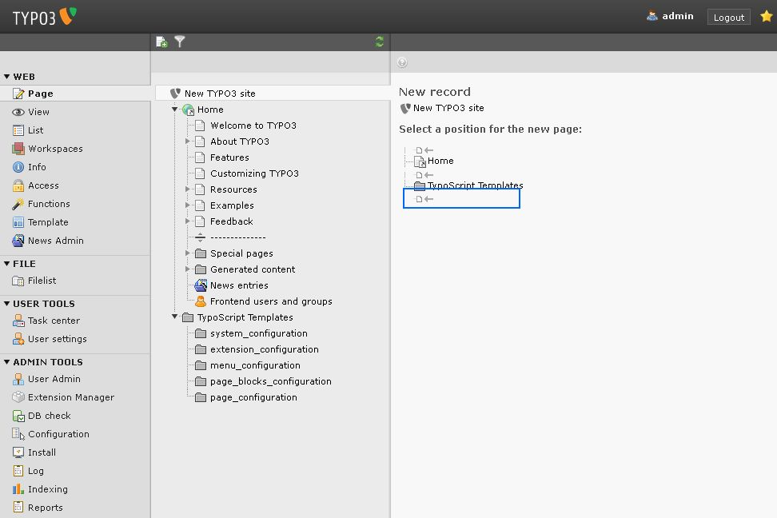

Change the page type to "Standard" and confirm that change. Give the page the Page Title "Root".

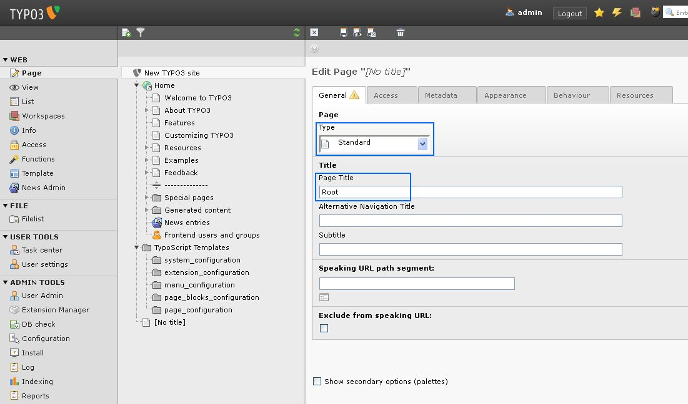

In the tab "Behaviour" in the palette "Miscellaneous" mark the checkbox "Use as root page".

.. figure:: ../Images/TBT-page-structure-new-4.jpg
   :alt: A new structure

Click "Save and close document". Now you see the new page with a globe icon in the page tree:

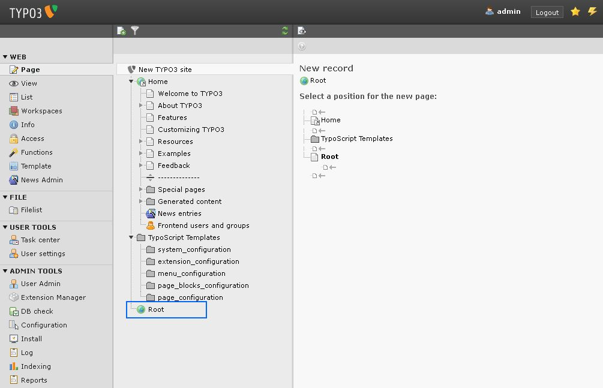

Create some subpages, which hierarchically are located inside that root page: Rightclick on the root page and from the context menu select "Page Actions > New".

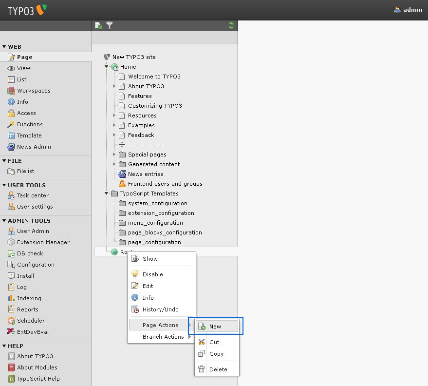

Place the new page hierarchically inside of the Root page.

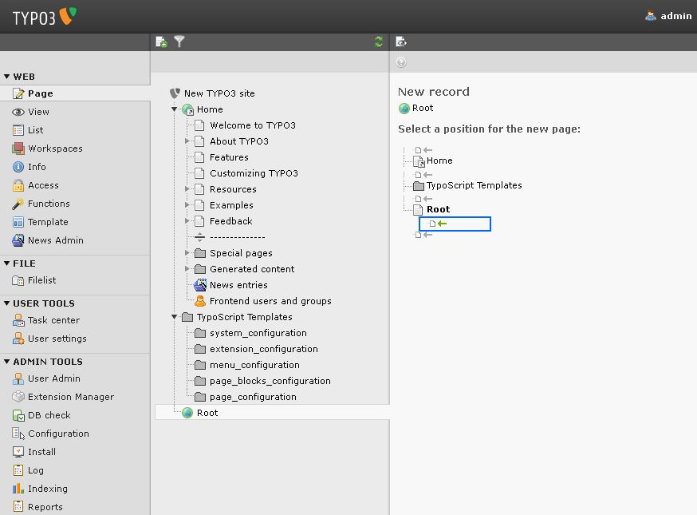

Give it the Page Title "Home".

In the tab "Access" make it visible by unchecking the option "Visibility > Page > Disable".

.. figure:: ../Images/TBT-page-structure-new-8.jpg
   :alt: A new structure

Click "Save and Close document".

The same way create some other subpages inside the root page. Place them on the same level as the page "Home", but below it. In the page tree, click on the small triangle in front of the page "Root":

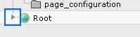

Then you can see the complete page structure. Here is what the result might look like:

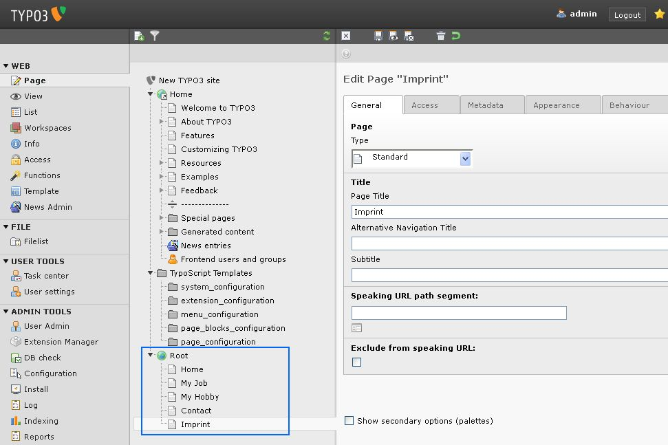

Edit the root page

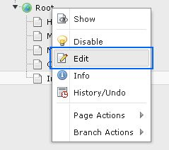

Change its Type to "Shortcut" and confirm that change.

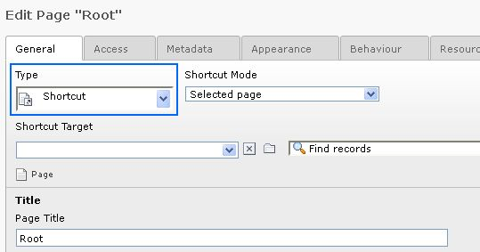

Click the small folder icon to select the target.

.. figure:: ../Images/TBT-page-structure-new-13.jpg
   :alt: A new structure

In the upcoming window, you can select the target. Choose the first page of the subpages. In our case this is the page, which we called "Home". Navigate there by clicking the small triangles in front of the page names. Then click on the page "Home".

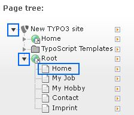

Back in the editing form from which you came, click "Save and close document".

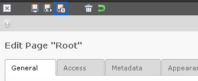