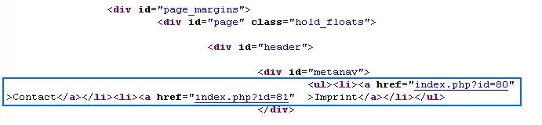

.. ==================================================
.. FOR YOUR INFORMATION
.. --------------------------------------------------
.. -*- coding: utf-8 -*- with BOM.

.. include:: ../../../../Includes.txt

.. _configure-metanav:

METANAV subpart
~~~~~~~~~~~~~~~

Before we begin defining the first subpart for our meta navigation,
let us have a look at where we are: first we have created a page structure
in the TYPO3 CMS Backend. TYPO3 CMS will later display these pages.
We have modified an HTML template file by adding subparts and marks for everything
which should be output dynamically by TYPO3 CMS. Again in the TYPO3 CMS Backend
we have created a template record in the root page. Inside that template record
we have instructed TYPO3 CMS to load our HTML template and to work with the part between the body tags.

In the next steps we will use the cObjects, which are offered by TYPO3 CMS,
to configure the output for each of our marks and subparts.

Now we will start with the first subpart. The meta navigation, which will be displayed at the top right corner of the screen, should hold a menu with some pages. We always want the same pages to be at that place (no matter on which page the user of our website currently is). We will put the pages "Contact" and "Imprint" there.

Since we basically want to output a menu, we define the subpart METANAV as

.. code-block:: typoscript

	page.10.subparts {
	METANAV = HMENU

Now we can use the properties of the cObject HMENU. With these properties you can output all kinds of *hierarchical menus*.

Just for you to remember here again is the HTML code, which was in our template and which we have to replace:

.. code-block:: html

    <body>
        <!-- ###DOCUMENT### Start -->
        

            

                

                    

                        <!-- ###METANAV### Start -->
                        <ul>
                           <li><a>Contact</a></li>
			   <li><a>Imprint</a></li>
                        </ul>
                        <!-- ###METANAV### End -->
                    

As you can see, we first have a ul tag, which stands for an unordered list. Inside that list each menu item is inside an li tag.

Since the HMENU cObject has the property "wrap", we can create a ul tag around our menu by adding

.. code-block:: typoscript

	METANAV.wrap = <ul>|</ul>

Now we only want to have some special pages to be displayed in our menu. This can be done with the "special" property. As you see in TSref, this property supports several different values. We choose

.. code-block:: typoscript

	METANAV.special = list

to create a list of selected pages.

For the type "special = list" there again are some subproperties available, the most important one being "special.value". Inside that property you have to define the page IDs, which should be part of the menu. In my case the pages "Imprint" and "Contact" have the page IDs 80 and 81, so to get them displayed I have to add:

.. code-block:: typoscript

	METANAV.special.value = 80, 81

However, *you will have to adjust this list* so that the IDs of your pages are used there.

The cObject HMENU can render menus. Since menus can have different levels of pages, HMENU offers "number properties", inside which you can define the rendering instructions for each page level seperately.
E.g. with "METANAV.1" we can define how pages on the first level of our menu should be rendered. "METANAV.2" would define the rendering of pages on level two and so on. (In fact it only makes sense to have one level of pages and not multiple levels for our meta navigation, but if you think of our subnavigation, you will notice that there we will have to define multiple levels.)

Have a look at the table of contents in TSref and look at the section "MENU Objects". These objects can be selected for each page level (e.g. for "METANAV.1"). The most important ones are TMENU and GMENU. TMENU creates a textual menu and GMENU creates a graphical menu.

For METANAV.1 we want to have simple text and no graphics. So we define

.. code-block:: typoscript

	METANAV.1 = TMENU

Note that TMENU and GMENU are *not* content objects (although their names
look similar to HMENU, which *is* a content object). So you cannot use them
to replace a mark or a subpart (which you *can* use HMENU for)! TMENU and GMENU
can only be used inside a menu (like inside an HMENU)!

Inside of the object TMENU we can now define the rendering of one single menu item (that is one single link to a page).

The object TMENU has several properties. The most important ones are the so called "Common Item States". In the table "Common item states for TMENU, GMENU and IMGMENU series" you find these properties, which are available for TMENUs, GMENUs and IMGMENUs. Additional properties for TMENUs are listed in the table "TMENUITEM".

We only need the table with the common properties now. This table lists the menu item states.
With these states you can define the rendering of each menu item based on its current state.
The state "NO" stands for "normal", that is the state in which a menu item is by default.
If you do not define another more special state, which applies for a menu item,
the state NO will be used to render it. The state "ACT" is used for menu items which are
in the rootline currently (and so kind of "active"). The definition of "CUR" is used
for the "curent" page, that is exactly the one page which the user is currently on.
That way you can display the links differently e.g. by adding different CSS classes.
We will do that for the subpart TOPNAV.

For our menu we will only use the default state NO. That way the links will always be rendered the same way, no matter if the user currently is on the linked page or not. Or with other words: If we only define this state and no other states here, TYPO3 will use these rendering instructions for all items on page level one in that menu.

Before you use an item state, you should always activate it by setting it to 1:

.. code-block:: typoscript

	METANAV.1 {
		NO = 1
	}

While activating the item state is *not* needed for the item state NO, it *is* needed for all other item states. If you forget it there, the rendering, which you supplied for that state just will not be used. To not make this mistake it is better to always activate all item states explicitly before you use them.

Now we want the pages in our menu to be each wrapped in li tags. Have a look at the table "TMENUITEM" now. There you find the property "allWrap", which wraps the whole item. Exactly what we want, isn't it?

.. code-block:: typoscript

	METANAV.1 {
		NO = 1
		NO {
			# Each entry is wrapped by
			# <li> </li>
			allWrap = <li>|</li>
		}
	}

This completes the code we need for our meta navigation. I have rewritten it with brakets now and I have slightly restructured the properties.
Here it is again:

.. code-block:: typoscript

	######################################################
	#
	# Configuration of SUBPARTS
	#
	######################################################

	# Define the subparts, which are inside the subpart DOCUMENT
	page.10.subparts {

		##############################################
		#
		# Subpart METANAV
		#
		##############################################

		# The subpart METANAV outputs the meta navigation
		# at the top right corner of the page
		METANAV = HMENU
		METANAV.wrap = <ul>|</ul>

		# Only display special pages here: Contact and Imprint
		METANAV.special = list
		# LIST NEEDS MODIFICATION:
		# Take your page IDs!
		# Change the values in the following list!
		METANAV.special.value = 80, 81

		METANAV.1 = TMENU
		METANAV.1 {

			# NO: default formatting
			NO = 1
			NO {
				# Each entry is wrapped by
				# <li> </li>
				allWrap = <li>|</li>
			}
		}
	}

	######################################################
	#
	# Configuration of MARKS
	#

And here is a screenshot of the HTML source code of the resulting output:

