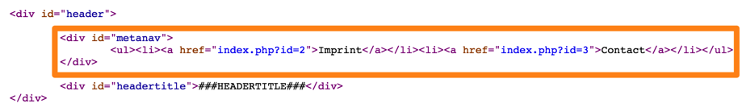

.. include:: ../../../../Includes.txt

.. _configure-metanav:

METANAV subpart
~~~~~~~~~~~~~~~

Before we begin defining the first subpart for our meta navigation,
let us recap our progress so far: first we have imported a page structure
in the TYPO3 CMS Backend. TYPO3 CMS will later display these pages.
We have modified an HTML template file by adding subparts and marks for everything
which should be output dynamically by TYPO3 CMS. Again in the TYPO3 CMS Backend
we have created a template record in the root page. Inside that template record
we have instructed TYPO3 CMS to load our HTML template and to work with the part between the body tags.

In the next steps we will use the cObjects, which are offered by TYPO3 CMS,
to configure the output for each of our marks and subparts.

Now we will start with the first subpart. The meta navigation, which will be displayed
at the top right corner of the screen, should hold a menu with some pages.
We always want the same pages to be at that place (no matter on which page
the user of our website currently is). We will put the pages "Contact" and "Imprint" there.

Since we basically want to output a menu, we define the subpart METANAV as

.. code-block:: typoscript

	page.10.subparts {
	METANAV = HMENU

Now we can use the properties of the :ref:`HMENU object <t3tsref:cobj-hmenu>`.
With these properties you can output all kinds of *hierarchical menus*.

As a reminder, here is the HTML code that is in our template file and that we
want to replace with something dynamically generated by TYPO3 CMS:

.. code-block:: html

    <body>
        <!-- ###DOCUMENT### Start -->
        

            

                

                    

                        <!-- ###METANAV### Start -->
                        <ul>
                           <li><a>Contact</a></li>
			   <li><a>Imprint</a></li>
                        </ul>
                        <!-- ###METANAV### End -->
                    

As you can see, we first have a ul tag, which stands for an unordered list. Inside that list each menu item is inside an li tag.

Since the :code:`HMENU` object has a :code:`wrap` property, we can use it
to create an :code:`<ul>` tag around our menu by adding:

.. code-block:: typoscript

	METANAV.wrap = <ul>|</ul>

As we only want a few select page to be displayed in this menu, we will use the
:ref:`special <t3tsref:hmenu-special>` property. As you can see in TSref,
this property supports several different values. We choose:

.. code-block:: typoscript

	METANAV.special = list

to create a list of selected pages.

Again the type :code:`special = list` has a number of subproperties.
The most important one is :code:`special.value`, which makes it possible
to hand-pick specific pages using their IDs. Check the IDs of the
"Contact" and "Imprint" pages in your TYPO3 CMS installation.
If you started with an empty installation, they might well be "3" and "2"
respectively, so we use these numbers that way:

.. code-block:: typoscript

	METANAV.special.value = 2, 3

.. important::

   Please adjust this list according to your page IDs, otherwise the menu
   will be wrong or even completely empty.

The :code:`HMENU` object can render menus. Since menus can have different levels of pages,
:code:`HMENU` uses numbered properties, where each number corresponds to a depth level.
Hence with :code:`METANAV.1` we can define how pages on the first level of our menu should be rendered.
:code:`METANAV.2` would define the rendering of pages on level two and so on.
Our metanavigation requires a single level.

The section in the TSref about :ref:`MENU objects <t3tsref:menu-objects>` shows
what kind of objects can be used for actually rendering a menu level.
The most important ones are :code:`TMENU`, which generates a text menu,
and :code:`GMENU`, which creates a graphical menu.

For :code:`METANAV.1` we want to have simple text and no graphics. So we define:

.. code-block:: typoscript

	METANAV.1 = TMENU

.. note::

   :code:`TMENU` and :code:`GMENU` are *not* content objects (although their names
   look similar to :code:`HMENU`, which *is* a content object). So you cannot use them
   to replace a mark or a subpart (which you *can* use :code:`HMENU` for)! :code:`TMENU` and :code:`GMENU`
   can only be used inside a menu (like inside an :code:`HMENU`)!

Inside of the :code:`TMENU` object we can now define the rendering
of a single menu item (that is one single link to a page).

The :code:`TMENU` object has several properties. The most important ones are the so-called
"Common Item States" (because they are shared by the various menu objects).
In the TSref, the :ref:`Common item states for TMENU, GMENU and IMGMENU <t3tsref:tmenu-gmenu-imgmenu-common-properties>`
list the properties, which are available for all menu objects.

The item states are used to define the rendering of each menu item based on its current state.
State :code:`NO` stands for "normal", i.e. the state in which a menu item is by default.
If you do not define another more special state, all menu items will use state :code:`NO`.
State :code:`ACT` is used for menu items which are currently in the rootline (and so kind of "active").
State :code:`CUR` is used for the "curent" page, i.e. the very page the user is currently on.
That way you can display the links differently e.g. by adding different CSS classes.
We will do that for the subpart :ref:`TOPNAV <configure-topnav>`.

For our menu we will only use the default state :code:`NO`. That way the links
will always be rendered the same way, no matter if the user currently is on the linked page or not.

Before you use an item state, you should always activate it by setting it to 1:

.. code-block:: typoscript

	METANAV.1 {
		NO = 1
	}

.. note::

   Activating the :code:`NO` item state is actually *not* ncessary, but it *is* needed for all other item states.
   If you forget it there, the rendering, which you supplied for that state will simply not be used.
   To avoid this mistake it is better to always activate all item states explicitly before you use them.

Now we want the pages in our menu to be each wrapped in :code:`<li>` tags.
Since we are using a :code:`TMENU`, each item will be rendered as a
:ref:`TMENUITEM <t3tsref:tmenuitem>`. Looking at this object's properties,
your will find the :code:`allWrap` property, which wraps the whole item.
This is exactly what we want.

.. code-block:: typoscript

	METANAV.1 {
		NO = 1
		NO {
			// Each entry is wrapped by
			// <li> </li>
			allWrap = <li>|</li>
		}
	}

This completes the code we need for our meta navigation. Below is the full listing
slightly rewritten:

.. code-block:: typoscript

	// Define the subparts, which are inside the subpart DOCUMENT
	page.10.subparts {

		////////////////////////////////////////////////////////////////////////////////////////////
		//
		// Subpart METANAV
		//
		////////////////////////////////////////////////////////////////////////////////////////////

		// The subpart METANAV outputs the meta navigation
		// at the top right corner of the page
		METANAV = HMENU
		METANAV.wrap = <ul>|</ul>

		// Only display special pages here: Contact and Imprint
		METANAV.special = list
		// LIST NEEDS MODIFICATION:
		// Take your page IDs!
		// Change the values in the following list!
		METANAV.special.value = 2, 3

		METANAV.1 = TMENU
		METANAV.1 {

			// NO: default formatting
			NO = 1
			NO {
				// Each entry is wrapped by
				// <li> </li>
				allWrap = <li>|</li>
			}
		}
	}

And here is a screenshot of the HTML source code of the resulting output:

