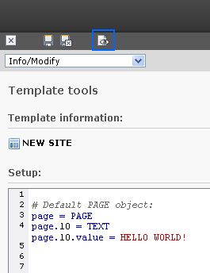
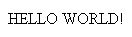

.. ==================================================
.. FOR YOUR INFORMATION
.. --------------------------------------------------
.. -*- coding: utf-8 -*- with BOM.

.. include:: ../../../Includes.txt

.. _how-to-use:

How to use TSref
****************

Before we continue to write our own TypoScript, let us have a look at the lines, which already are there.

.. code-block:: typoscript

	# Default PAGE object:
	page = PAGE
	page.10 = TEXT
	page.10.value = HELLO WORLD!

Did you read the Tutorial TypoScript in 45 Minutes? If you did, you
should already know, what these lines are doing. To remind you, here is
a short explanation. We will also use this explanation to repeat (or to
learn) how to use TSref!

You do not have a copy of TSref currently? TSref, the TypoScript
reference, is available from here: https://docs.typo3.org/typo3cms/TyposcriptReference/
Use it to conveniently look things up.

- Lines starting with "#" are comments. You can use them to comment your code.
  They are not parsed, when TYPO3 reads the template to render the website.

- In the next line the object "page" is defined and set to the value "PAGE".
  This value refers to a "page object". Have a look at the section "Setup" in TSref
  (remember that we are editing the "Setup" field). In the table with the headline "Top-level objects"
  you will find information about the objects, which can be set on the first level of TypoScript templates.
  One of them is called "PAGE". The definition of this PAGE object tells TYPO3
  that it should start the output of a new page. As you see in TSref, the data type of this object is "->PAGE".
  This tells you that you should look into the table with the headline "PAGE",
  to see the configuration options for the PAGE object. This table follows some pages later in TSref.

- When you look into the table with the options for the "PAGE" object in TSref,
  you will see that there are several properties, which you can set inside a PAGE object,
  e.g. "typeNum", "wrap", "stdWrap", numbers (like "1", "2", "3") and so on.
  The next line in the code above defines the object "page.10", which is one of those "number objects".
  It could also be called for example "page.5" or "page.20".
  TSref does not say much about the meaning of these numbers except the data type, which is "cObject".
  Have a look at the section "Data types" at the beginning of TSref.
  In the subsection "Data types: Object types" you will find the description of the data type "cObject".
  It means that you can set the value to any "content object".

  .. note::

     A "cObject" or "content object" is not a "content element". A "content element" is an element,
     which is displayed on a single page in the website. Content elements can be edited in the Page module.

  To get an overview of the available content objects have a look at the table of contents in TSref.
  There is a section called "Content Objects" which lists all available content objects.
  There you see that e.g. TEXT, IMAGE, USER, COA... are possible values.
  Depending on what you want to display, you can pick the one you like.
  You then find the options for the one you have chosen in the according section in TSref.

  Now you know that in line 3 of the listing above, a content object of the type TEXT is defined and why that is possible.

- Finally there is a subproperty under "page.10". Since "page.10" is a TEXT content object,
  we have a look at the properties of this content object in TSref.
  There we see that the cObject TEXT has the subproperty "value" (and some other subproperties,
  which can be found in the section "stdWrap", but are not important here).
  In our listing the subproperty "value" is set and as TSref tells us, it basically contains text.
  Here it is set to "HELLO WORLD!"

What you should have learnt from this chapter is, how properties can be set in TypoScript.
Now you should understand, how you can use TSref to look up the available properties for each object and how to use them to create your own TypoScript.

By the way: Did you know, that these four lines already create an output? It is not much, but more than nothing.
Click on the  "View webpage" icon at the top of the screen.

What you see is this:

