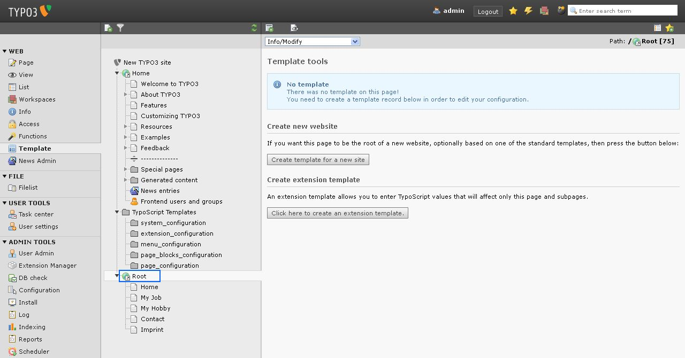
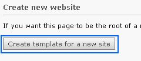
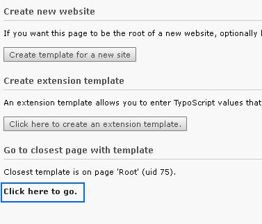
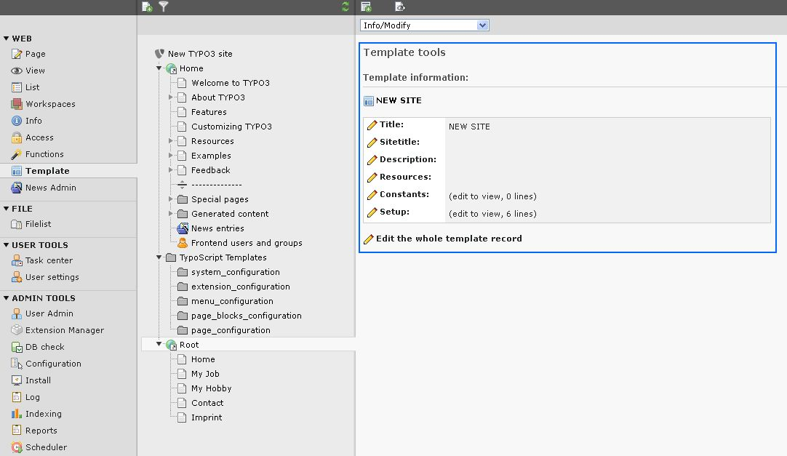
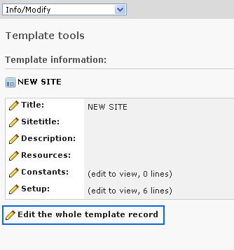
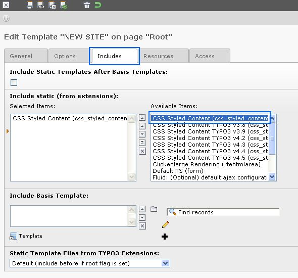
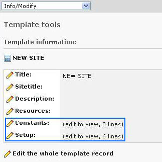
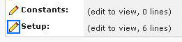
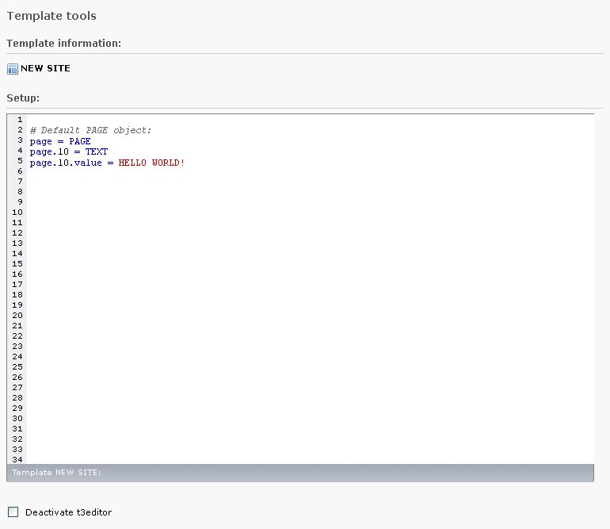

.. ==================================================
.. FOR YOUR INFORMATION
.. --------------------------------------------------
.. -*- coding: utf-8 -*- with BOM.

.. include:: ../../../Includes.txt

.. _typoscript-template:

TypoScript template records - a brief introduction
**************************************************

A TypoScript template is a record that contains the configuration information used to display content
in a website; the frontend. It is written using the TypoScript scripting language.
The templates are edited in the "Web" section of the TYPO3 backend and
are stored in the database in the sys_template table.

Typoscript can be used to control nearly everything in the frontend, for example the doctype,
the meta data in the header element of your website, the display of content inside the body tag and
even each single rendering instruction, which TYPO3 uses internally to display your content elements.

For more information on the options available in TypoScript template records,
see the :ref:`TypoScript reference, TSref <t3tsref:start>`.

.. _create-ts-template:

Create a new TypoScript template
********************************

Let's start building our TypoScript template. Go to the Template module by opening the section "Web" and clicking on "Template":

.. figure:: ../../../Images/TBT-template-module.jpg
   :alt:

You cannot see the Template module?
The Template module is only accessible for administrators in TYPO3. Login with an administrator account and you will be able to see and use it.

In the page tree activate the "Root" page, which you have created before you worked in the HTML template file. You will see this screen:

As you can see, there currently is no TypoScript record on our root page. So we have to create one, so that TYPO3 knows, how it should dispay our root page - and also all its subpages - in our website. Note that the template record is inherited to all subpages. That means that the configuration, which we insert in the template record of our root page, will automatically be used for all subpages as well.
To create a new template record click on "Create template for a new site".

After you have done so, you will come to the same screen, but there will additionally be the information, that there now is a template record on the page "Root" (with the id, which this page has in your system. In my case it is 75, but the ID does not matter now.). Click the link "Click here to go."

Now you see the "Info/Modify" screen. From here you can edit the whole template record or choose one single field of the record, which you want to view or change.

First there is one important step, which we need to do: there is a so called "static template",
which comes with TYPO3 CMS. This static template already contains some TypoScript code.
If we include this static template in our template record, it will help us,
as we do not have to write each line of the code we need ourselves.
Instead we can use a short one-liner to copy parts from this static template.
(This is done when we insert the actual content for the subparts CONTENTRIGHT and CONTENTMIDDLE).

Click the button "Edit whole template record".

Click the tab "Includes" and in the palette "Include static (from extensions)" click the item "CSS Styled Content (css_styled_content)" as marked in the screenshot. Then it will be added to the list on the left. When that is done click the icon "Save and close document" at the top.

You do not see the entry "CSS Styled Content (css_styled_content)" in the right list?
Then you most probably have not installed the TYPO3 system extension "css_styled_content".
Go to the Extension Manager, open the tab "Available extensions",
watch out for the extension key "css_styled_content" and install the extension.
Now include the static template as explained above.

You now are back in the Info/Modify screen. Here you can see some sections of the TypoScript template.
The most important sections in a TypoScript template are the ones called "Constants" and "Setup".

In the section "Constants" you can - you guess it - define constants. These constants can then be used in the setup field of the template. Doing so is a bit more advanced and we will not do that in this tutorial.
The field labeled "Setup" is the one, in which we will enter all the TypoScript configuration. As you can see in the screenshot above, it already contains six lines of code. Click the small pencil next to the word "Setup".

Now you can have a look at the content of the setup field. This is what you will see:

You don't see the code in different colors, but just as black text? Then you most probably have not installed the TYPO3 system extension "t3editor". You can install this extension by going to the Extension Manager, having a look at the tab "Available extensions" and by clicking the small icon in front of the row where it says "t3editor". Afterwards you should be able to see the code colored as in the screenshot above. If you still do not see the code colored, make sure that you have not checked the checkbox "Deactivate t3editor", which you see at the bottom of the above screenshot.

.. note::

   The t3editor helps with syntax-highlighting, but keep in mind, that if you use extensions, the t3editor does not know about valid properties. So, if something is not highlighted it does not mean that it is wrong - if something is highlighted, it does not mean, that it is right. If something does not work like expected read the relevant manuals.}}
