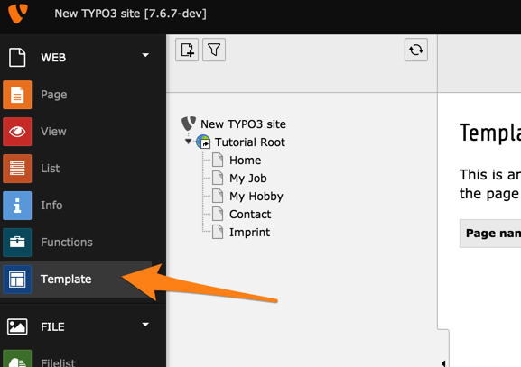
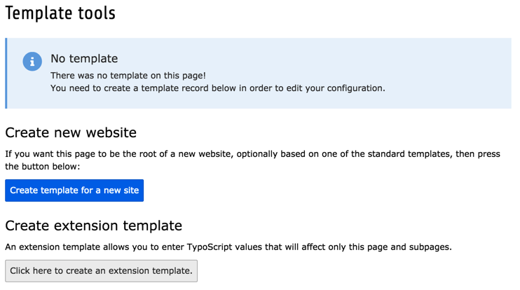
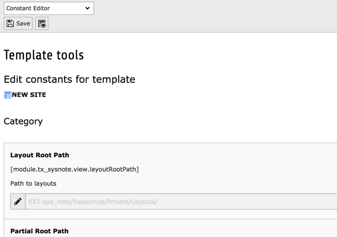
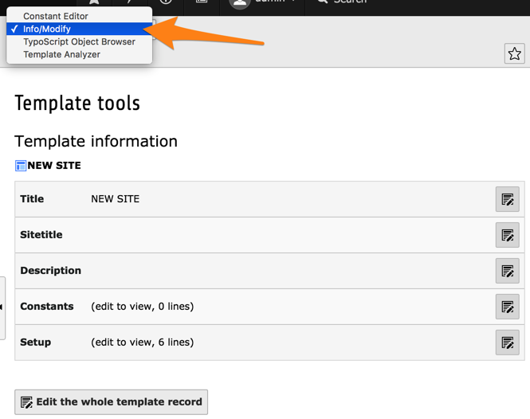
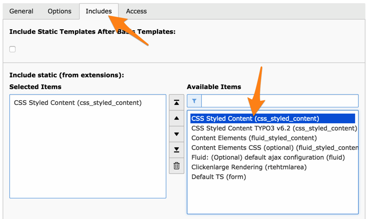
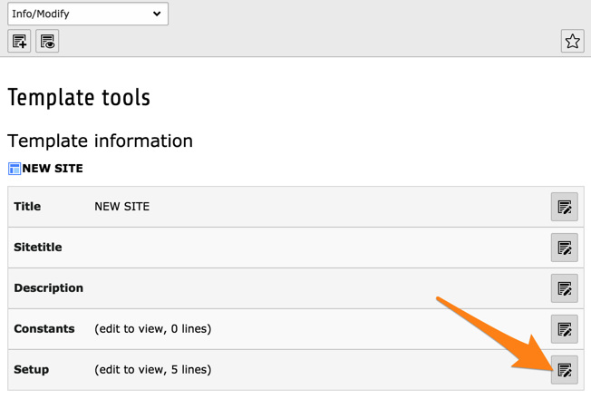
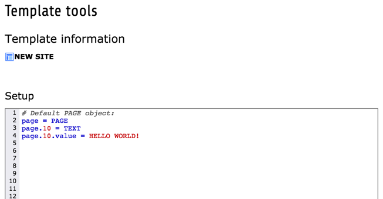

.. include:: /Includes.rst.txt

.. _typoscript-template:

TypoScript template records - a brief introduction
**************************************************

A TypoScript template is a record that contains the configuration information used to display content
in a website; the frontend. It is written using the TypoScript scripting language.
The templates are edited in the "Web" section of the TYPO3 CMS backend and
are stored in the database in the sys_template table.

Typoscript can be used to control nearly everything in the frontend, for example the doctype,
the meta data in the header element of your website, the display of content inside the body tag and
even each single rendering instruction, which TYPO3 uses internally to display your content elements.

For more information on the options available in TypoScript template records,
see the :doc:`TypoScript reference, TSref <t3tsref:Index>`.

.. _create-ts-template:

Create a new TypoScript template
********************************

Let's start building our TypoScript template. Go to the **WEB > Template** module.

.. note::

   If you cannot see the *Template* module, it may be that you are not logged in
   as an administrator. Please change user and make sure you use one with
   administrator rights.

In the page tree click on the "Tutorial Root" page. You will see this screen:

As you can see, there currently is no TypoScript record on our root page.
We have to create one, so that TYPO3 CMS knows how it should display our root page
- and also all its subpages - in our web site. Note that the template record is inherited to all subpages.
That means that the configuration, which we insert in the template record of our root page,
will automatically be used for all subpages as well.

To create a new template record click on "Create template for a new site".
You should see the following:

The new template record has been automatically named "NEW SITE" and is ready
for update. The current view is the *Constant Editor* which is not what we
need rigth now. Choose "Info/Modify" from the menu in the docheader.

From this view you can edit several important parts of the template record,
in particular its title, the constants and the setup. You can also use the
button at the bottom to edit the whole record.

First of all we need to include the static template from "css\_styled\_content",
which contains a base rendering configuration for all types of content elements,
as is described in the :ref:`TypoScript in 45 Minutes tutorial <t3ts45:css-styled-content>`.

Click the "Edit whole template record" button and move to the "Includes"
tab. In the "Include static (from extensions)" field, choose the item called
"CSS Styled Content (css\_styled\_content)" as you can see in the screenshot.

.. note::

   If you do not see the entry called "CSS Styled Content (css_styled_content)"
   in the right-hand list, it is most probably because the TYPO3 CMS system extension
   "css\_styled\_content" is not installed. You need to
   go to **ADMIN TOOLS > Extensions** and install extension "css\_styled\_content".
   You can then come back and include the static template that it provides.

Choose the "Save and close" action and you will back on the *Info/Modify* screen.

As you can guess the "Constants" section is used to define TypoScript constants.
These constants can then be used in the setup field of the template.
This is actually not covered in this tutorial, but is described
in the :ref:`t3tsref:using-and-setting`
chapter of the "TypoScript Templating Reference".

The field labeled "Setup" is the one, in which we will enter all the TypoScript configuration.
As you can see in the screenshot above, it already contains a few lines of code.
Click the small pencil on the "Setup" line:

and you should see the following:

.. note::

   If you don't see highlighted text, it is probably because TYPO3 CMS system extension
   "t3editor" is not installed. Just go to **ADMIN TOOLS > Extensions**, install the extension
   and come back here. If you still do not see colors, make sure that the option
   "Deactivate t3editor" at the bottom of the screen is **not** checked.

The "t3editor" extension helps with autocompletion and syntax highlighting, but keep in mind that it knows only
about Core TypoScript configuration. If you use extensions, the "t3editor" will be somewhat
less helpful.

.. tip::

   While you are at it, you may want to also include the static template of the
   "form" system extension, called "Default TS (form)". This will make it possible
   to render the contact form provided on the "Contact" page.
